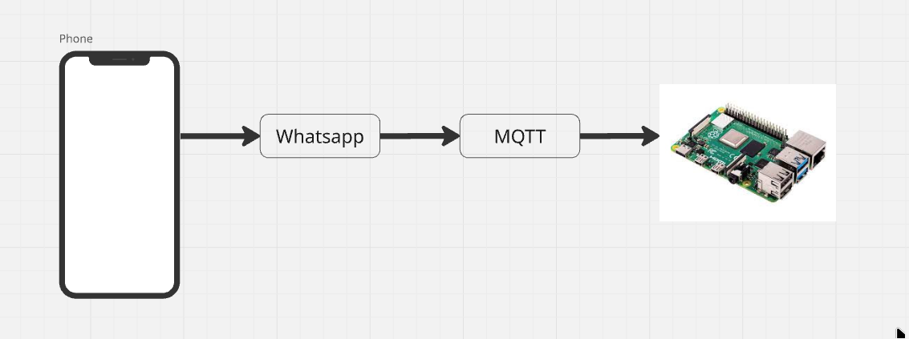

# Tarefa: Roteiro de FreeRTOS #2 - EmbarcaTech 2025

Autor: **Caio Vitor Carneiro de Oliveira**

Curso: Residência Tecnológica em Sistemas Embarcados

Instituição: EmbarcaTech - HBr

Campinas, Brasília de 2025

---

---

## 📜 Licença
GNU GPL-3.0.

# 🤖 Chatbot de Pedidos via WhatsApp + BitdogLab com Raspberry Pi Pico W

Este projeto implementa um **sistema completo de chatbot via WhatsApp** que recebe mensagens de pedido e envia para um **broker MQTT** (como o BitdogLab). Em seguida, um **dispositivo com Raspberry Pi Pico W** recebe as mensagens e exibe no display OLED, permitindo **navegar pelos pedidos e marcá-los como entregues**.

📺 **Demonstração em vídeo**: [Assista aqui](https://youtube.com/shorts/7oXLIwyqD30?si=wXsUT3KjS7P4Qyzp)

---

## ✅ Estrutura de tarefas

O sistema é dividido em múltiplas tarefas que rodam concorrentes, por exemplo:

| **Tarefa**     | **Descrição**                                                                 |
|----------------|--------------------------------------------------------------------------------|
| `mqtt_task`    | Responsável por manter a conexão com o broker MQTT e processar mensagens.     |
| `oled_task`    | Atualiza o display OLED com as mensagens recebidas e status do sistema.       |
| `input_task`   | Faz a leitura dos botões e joystick para navegação e marcação.                |

## 📦 Tecnologias Utilizadas

- Node.js + `whatsapp-web.js`
- Broker MQTT (local ou BitdogLab)
- Raspberry Pi Pico W
- FreeRTOS
- Display OLED SSD1306
- Joystick + Botão (GPIO)
- Conexão Wi-Fi integrada

---